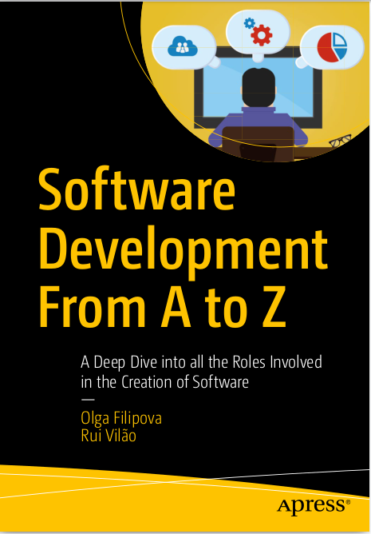

# Grupo de trabajo

- Adjunto interino semiexclusiva: Claudio Omar Biale

# Libro de referencia

- **Software Development From A to Z - A Deep Dive into all the Roles Involved in the Creation of Software** de Olga Filipova y Rui Vilão.

Este libro abarca la mayoría de los temas necesarios dictados durante el cursado de la materia. 

## Otros libros

Cubriremos temas tratados en los siguientes libros:

- **UML @  Classroom: An  Introduction to  Object-Oriented Modeling** de  Martina Seidl,Marion Scholz, Christian Huemer y Gerti Kappel: Excelente libro para abordar el análisis y diseño orientado a objetos.
- **The Elements of UML 2.0 Style** de Scott Ambler: Compendio de guías para UML.
- **Clean Code: A Handbook of Agile Software Craftsmanship** de Robert Martin.
- **UML y Patrones: Introducción al Análisis y Diseño Orientado a Objetos (2da. Edición)** de Craig Larman.
- **Applying UML and Patterns: An Introduction to Object-Oriented Analysis and Designand Iterative Development (3rd Edition)** de Craig Larman.
- **UML Distilled (3rd edition)** de Martin Fowler: Cubre UML (más algunas facetas del diseño orientado a objetos).
- **Real-World Software Development - A Project-Driven Guide to Fundamentals in Java** de Raoul-Gabriel Urma y Richard Warburton.

> Durante el transcurso de la materia se van a ir subiendo otros libros de referencia orientados a la programación principalmente.

# Consideraciones

Las presentacion(es o apuntes no reemplazan a la bibliografía de la asignatura.

# Objetivos del curso

Este curso cubre metodologías de construcción de software orientado a objetos y su aplicación. 

El componente principal del curso es un gran **proyecto en equipo**. 

Los temas del curso incluyen análisis y diseño orientados a objetos, UML, patrones de diseño, refactorización, pruebas de programas, repositorios de código, programación en equipo y revisiones de código.

# Evaluación y calificación

Se regulariza la materia mediante la realización de exámenes escritos basados en los temas tratados durante el cursado y lecturas solicitadas por la cátedra. No hay exámenes recuperatorios, las notas son acumulativas.

Se promociona la materia realizando un proyecto de equipo durante el cursado. Se deben realizar entregas cada dos semanas (iteraciones). 

Cada iteración del proyecto se evaluará con un puntaje máximo de **15**; habrá una presentación final (entregable) con un puntaje máximo de **25** puntos.

> Son 5 iteraciones con puntaje. No tiene puntaje la iteración 0. 

Consideren que:
- La comunicación es un elemento importante de la programación del equipo. 
- Habrá sesiones de clase dedicadas al trabajo en equipo.
- También habrá presentaciones para darle la oportunidad de describir su proyecto y permitir la crítica constructiva de toda la clase.

# Fases del diseño ingenieril

Podemos definir **ingeniería de software** como:

> *"La aplicación de un enfoque sistemático, disciplinado y cuantificable para el desarrollo, operación y mantenimiento de software"*.

Existe una metodología de diseño estándar siempre que se desee construir algo Los pasos de la misma son:
- Obtener los requisitos que, por ejemplo, debe cumplir un puente.
- Hacer un diseño completo *(planos, materiales, método de construcción, etc.)*.
- Construir *(implementar)*.
- Realizar pruebas para asegurar de que funcione.

> *En ingeniería de software, este es el modelo clásico en cascada, enfoque inicial a partir del cual evolucionaron otros enfoques.*

# Fases de la ingeniería de software moderna

La ingeniería de software moderna es una variación mucho más flexible de lo anterior.

Deben seguir un esquema como el siguiente:

- Comiencen con un primer paso en los requisitos y el diseño que no estarán completos.
- Implementen las funciones más importantes y obtenga la funcionalidad básica de ejecución.
- A medida que toma forma una implementación inicial, úsenla para refinar los requisitos y el diseño.
- Implementen más funciones, continúen refinando los requisitos y el diseño, y proporcionen versiones continuas de la aplicación en ejecución.

# Escuelas de desarrollo de software

Hay muchas escuelas sobre la mejor manera de desarrollar software en equipo.

> No vamos a mencionar explícitamente ninguna de las escuelas aquí, pero es posible que *"deseen leer sobre ellas"* en la **Lectura 1**.

# Modelo de proceso de software

Vamos a seguir un modelo híbrido que se basa principalmente en la metodología ágil (en particular, basado en métodos de desarrollo ágiles de Extreme Programming y SCRUM).

El tiempo que dedicarán a su proyecto a término se divide en una secuencia de seis iteraciones de dos semanas (comenzando en la iteración 0, que se divide de manera más sucinta en una semana de "Formación de grupos" seguida de una semana de "Especificación y planificación"). .

En cada iteración, deben centrarse en cumplir algunos requisitos funcionales claves de su aplicación. A medida que toma forma una implementación inicial, utilícenla para perfeccionar los requisitos y el diseño de su aplicación. A medida que pasan las iteraciones, implementen más características, continúen refinando los requisitos/diseñen más y proporcionen versiones continuas de la aplicación en ejecución.

# ¿Qué compromiso de tiempo se requiere?

¡Hagamos cuentas! Cada grupo debe planear trabajar colectivamente como un ingeniero desarrollador de software junior de tiempo completo. Digamos, trabajar unas 40 horas por semana. En la práctica, suele ser más que eso, ¡a menudo mucho más! Si hay al menos 5 personas por grupo, eso significa que cada una debe planear dedicar, en promedio, 8 horas por semana a la materia.

# Tareas iniciales

Deben:
- Cumplimentar la lectura 1.
- Conformar grupos de 3 a 5 integrantes, no se contemplan excepciones.
- Repasar y reforzar conceptos sobre Java.
- Repasar y reforzar temas tratados en ingeniería del software.

