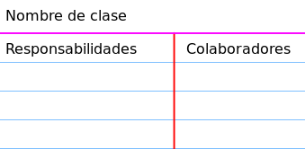
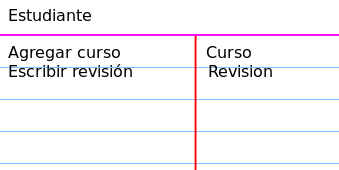

# Unified Modeling Language

> Una buena referencia rápida para UML es la de [Allen Holub](https://holub.com/uml/). 
>
> Una hoja de datos aún más concisa se encuentra en [uml-cheatsheet.pdf](./anexos/uml-cheatsheet.pdf).
> 

# Análisis y diseño orientado a objetos en su proyecto

Después de escribir el documento de especificación de requisitos y planificar sus iteraciones, es el momento de realizar el análisis y diseño orientados a objetos:

- Cuales son sus clases?
- ¿Cuántas deberían tener?
- ¿Qué comportamiento implementarán?
- ¿Cuánto sabe una clase sobre otras clases?
- ¿Cuánto de sí mismas deberían exponer?

Decidir qué clases usar (para implementar una solución a un problema) puede ser una tarea difícil.

> Se deben diseñar las clases para modelar la aplicación y se debe considerar que deben sean fáciles de cambiar.

Muchas de las decisiones que tomen hoy deberán cambiarse más adelante. Cuando llegue ese día, su capacidad para realizar esos cambios con éxito estará determinada por el diseño de su aplicación.

## ¿Qué significa "fácil de cambiar"?

Fácil de cambiar significa que:
- los pequeños cambios en los requisitos requieren, en consecuencia, pequeños cambios en el código.
- los cambios tendrían consecuencias obvias *(sin efectos secundarios inesperados)*.

# Extraer clases de la descripción del problema

Supongamos que han seleccionado algunas historias de usuario para implementar en la próxima iteración. Ahora necesitan extraer clases de la descripción del problema *(Historias de usuario)*. Usaremos un método bastante simple para abordar esta tarea, que sirve bien para la mayoría de los problemas de software. Implica:

- usar el método verbo/sustantivo para descubrir clases iniciales.
- utilizar tarjetas CRC para descubrir las responsabilidades *(comportamientos)* de cada clase y la colaboración *(relaciones)* entre ellas.

## El método verbo/sustantivo

Consiste en leer una historia de usuario en busca de **sustantivos** que representen **objetos** en el dominio del problema. Estos sustantivos representan los candidatos más simples para ser **clases**. Además, las **acciones** que determinan el comportamiento de las clases a menudo se revelan como **verbos** en una historia de usuario.

Por ejemplo, considere la siguiente historia de usuario:

```
Como estudiante, quiero agregar un curso, para poder escribir una reseña para él.
```

Los sustantivos "**Estudiante**", "**Curso**", "**Revisión**" son candidatos a clases. Los verbos "**agregar**" *(un curso)* y "**escribir**" una revisión son candidatos para los métodos *(comportamiento)* compartidos entre las clases.

El método verbo/sustantivo es una puerta de entrada a su diseño, ¡pero no debe seguirlo religiosamente! No todos los sustantivos ni todos los verbos corresponden a clases/comportamientos. Es posible que más adelante descubra que necesita algunas clases adicionales o que algunas de las clases extraídas en esta etapa no son necesarias.

> Los nombres de las clases son singulares en lugar de plurales. Esto se debe a que la multiplicidad se logra creando múltiples instancias de una clase.

## El modelo CRC

Un modelo de **Class Responsibility Collaborator (CRC)** es una colección de fichas estándar que se han dividido en tres secciones, como se muestra a continuación.



Un ejemplo de una tarjeta CRC para la historia de usuario antes mencionada es el siguiente:




Una **responsabilidad** es algo que una clase sabe o hace. A menudo, una clase tiene que colaborar con otras clases para cumplir con una responsabilidad. La colaboración suele adoptar una de dos formas: 
- una solicitud de información o 
- una solicitud para hacer algo.

El modelo CRC se utilizó originalmente como una técnica de enseñanza, pero es una herramienta de modelado eficaz dentro del desarrollo de software ágil.

### Sesiones CRC

El objetivo de una sesión de CRC es descubrir clases y convertirlas en tarjetas CRC. Se recomienda hacer esto en grupo para fomentar y facilitar la lluvia de ideas de buenas soluciones.

La sesión implica realizar iterativamente los siguientes pasos:

- Extraer clases.
- Encontrar responsabilidades.
- Definir colaboradores.
- ¡Juego de roles para refinar responsabilidades / colaboradores!

El resultado de una sesión CRC, como el del método verbo/sustantivo, no es definitorio. Cuando lleguen a implementar el modelo, se introducirán nuevas clases, se reorganizarán las responsabilidades, las clases existentes desaparecerán, etc.

### Juego de roles

Cada historia de usuario describe un "escenario" para utilizar el software. Una práctica común es "ejecutar un escenario" donde cada participante desempeña el papel de una clase y el grupo simula colectivamente la historia del usuario.


> Beck K., Cunningham W., "A Laboratory For Teaching Object-Oriented Thinking", available at http://c2.com/doc/oopsla89/paper.html (1989).

> Advertencia
> 
> - El documento de especificación de requisitos es la entrada inicial al proceso. El documento debe incluir historias de usuarios. Un proyecto que no puede proporcionar este documento no está listo para comenzar a modelar.
> - Los participantes deben haber leído y deben estar familiarizados con documento de especificación de requisitos que se utilizará en la sesión.
> - Una sesión debe centrarse en una parte bastante pequeña y manejable del sistema. Lo mejor es centrarse en el subconjunto de historias de usuario que se implementarán en la próxima iteración.

# ¡El diseño es difícil!

**¡El diseño perfecto está sobrevalorado!** Algunos consideran que solo es posible hacerlo si se viaja en el tiempo al futuro. Por supuesto, hay algunas decisiones de diseño que son más fáciles de tomar. Sin embargo, en la práctica y en la mayoría de los casos, siempre hay algunos diseños alternativos interesantes e igualmente recomendables. 

Traten de no perder mucho tiempo pensando en las opciones de diseño; **¡Elijan uno y comience a codificar!** Siempre pueden mejorarlo más tarde.

Dicho esto, ¡tengan cuidado de no delegar demasiado en su yo futuro! Cuando se enfrenten a una decisión de diseño, pregúntense: **"¿Cuál es el costo futuro de no hacer nada hoy?"** Cada elección tiene un precio. 

El dilema de "mejorarlo ahora" versus "mejorarlo después" siempre existe. 

El proceso quizás se vuelva un poco más fácil cuando estudiemos sobre los principios de diseño.

Los principios de diseño son los mandamientos de la programación orientada a objetos. A continuación, exploraremos dos principios fundamentales sobre cohesión y acoplamiento.
propina

> El camino hacia el software orientado a objetos modificable y mantenible comienza con clases que son muy cohesivas y están poco acopladas.

# Alta cohesión

Debemos asegurarnos de que cada clase sea **altamente cohesiva**.

La **cohesión** es una medida de que tan relacionadas están entre sí las responsabilidades de una clase

Una clase altamente cohesiva tiene un conjunto de responsabilidades relacionadas y no realiza una gran cantidad de trabajo

Una clase con baja cohesión no es deseable ya que presenta los siguientes problemas:
- Es difícil de comprender
- Es difícil de reutilizar
- Es difícil de mantener
- Se ve afectada por cambios en forma constante
  
Las clases con baja cohesión tomaron demasiadas responsabilidades que pudieron haber delegado a otras clases.

Unas clases con alta cohesión son ventajosas ya que son fáciles de mantener, entender y reutilizar

> Idealmente, una clase tiene una sola responsabilidad.

## ¿Por qué importa esto?

Las aplicaciones que son fáciles de cambiar consisten en clases que son fáciles de reutilizar.

Una clase que tiene muchas responsabilidades es difícil de reutilizar.

Una clase que tiene varias responsabilidades, tiene muchas razones para cambiar. 

Cuando cambia
- puede cambiar por una razón que no está relacionada con su uso.
- existe la posibilidad de romper todas las clases que dependen de ella.

## ¿Cómo saber si una clase no es cohesiva?

Aquí hay una estrategia: describan su clase en una oración.
- si no pueden, probablemente la clase tenga demasiadas responsabilidades.
- si su descripción tiene "y"/"o" ​​en ella, probablemente tenga demasiadas responsabilidades.

# Bajo acoplamiento

Consiste en asignar responsabilidades de forma tal que el acoplamiento general se mantenga bajo. 

El **acoplamiento** es una medida de que tanto una clase está relacionada o si tiene conocimiento de o depende de otras clases.

Una clase con bajo acoplamiento  depende de pocas clases, en cambio una con alto acoplamiento depende de demasiadas clases.

Una clase con alto acoplamiento no es deseable ya que presenta los siguientes problemas:
- Cambios en las clases en las que se depende fuerzan cambios locales
- Es difícil de comprender en forma aislada
- Es difícil de reutilizar ya que requiere de la presencia de las clases de las que depende.

> Formas comunes de acoplamiento entre elementos X e Y pueden ser:
> - X tiene un atributo de tipo Y.
> - X tiene un método que referencia a una instancia de Y. Esto puede ser porque: Tiene una variable local, tiene un parámetro formal o retorna una instancia de tipo Y.
> - X es subclase directa o indirecta de Y.
> - Y es una interfaz y X la implementa.

## ¿Por qué importa esto?

Las aplicaciones que son fáciles de modificar consisten en clases que están acopladas de manera flexible.

Una clase que está estrechamente acoplada a otras clases, puede necesitar cambiar si esas clases cambian.

En un sistema fuertemente acoplado, cuando una clase cambia, existe un mayor riesgo de romper varias otras clases *(que dependen de la que se cambió)*.

## ¿Cómo saber si el acoplamiento es alto?

Cuando observan el diagrama de clases UML de su diseño, cada "relación" es una indicación de acoplamiento. Cuantas más relaciones tenga *(y cuanto más fuertes sean las relaciones)*, mayor será el acoplamiento.

> A veces, el acoplamiento no se manifiesta en un diagrama UML. Esto es cuando, por ejemplo, una clase depende del funcionamiento interno de otra clase. Esta es la forma más fuerte (y más desagradable) de acoplamiento.

Puede que sea imposible eliminar el acoplamiento, pero deben esforzarse por minimizarlo.