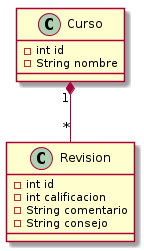
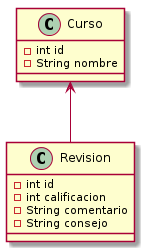
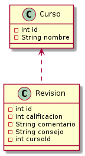

# Tarea 1

## Introducción

Vamos a dejar como parte del dominio del proyecto a `Revision` y `Curso`.

Agregamos a `Revision` y `Curso` un atributo `id`, que identifique a cada `Revision` y `Curso` de manera única.

La asociación bidireccional entre `Revision` y `Curso` es un ejemplo de alto acoplamiento; tanto `Revision` como `Curso` deben conocerse mutuamente. Si cambiamos uno, es posible que tengamos que cambiar el otro.

Por otro lado, para que las clases sean poco acopladas, podemos indicar que solamente `Revision` conozca a `Curso`.

Para llegar a un caso de menor acoplamiento al indicar que `Revision` solo conoce el id del `Curso`.

## Desarrollo

1. Considere que beneficios trae para su sistema cada caso, enumere los mismos.
2. Que critica puede hacer al ultimo paso realizado.

